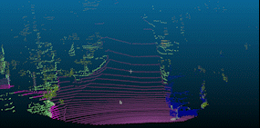

# PointPainting (3D semantic segmentaiton)
This is naive implementation of [PointPainting](https://arxiv.org/abs/1911.1015010) where any image segmentation network can be used for 3D point cloud segmentaiton where each point is labelled with a class.


### Installation 
```pip install requirements.txt```
```pip install timm==0.3.2```
```CUDA 10.1``` and  ```pytorch 1.7.1``` 

```
pip install torchvision==0.8.2
pip install timm==0.3.2
pip install mmcv-full==1.2.7
pip install opencv-python==4.5.1.48
cd SegFormer && pip install -e . --user
```

For more details for installtion visit [SegFormer](https://github.com/NVlabs/SegFormer)

Works for any dataset (edit calibration file)

This is implemented on [KITTI360](https://www.cvlibs.net/datasets/kitti-360/)
## Run Instructions
```
python point_paint.py $PATH_TO_DATA $PATH_TO_CONFIG $PATH_TO_CHECKPOINT --device cuda:0 --palette cityscapes
```

```
python point_paint.py ./SegFormer local_configs/segformer/B5/segformer.b5.1024x1024.city.160k.py 
                ./SegFormer/segformer.b5.1024x1024.city.160k.pth --device cuda:0 --palette cityscapes
```

## File structure
    Phase1
    ├── SegFormer Folders
    ├── data    <--KITTI360
    |  ├── rgb
    |  ├── fused_pcd
    ├── calib.txt <-- calibration config from KITTI360
    ├── utils.py 
    ├── calibration.py
    ├── point_paint.py

### References
https://github.com/AmrElsersy/PointPainting
